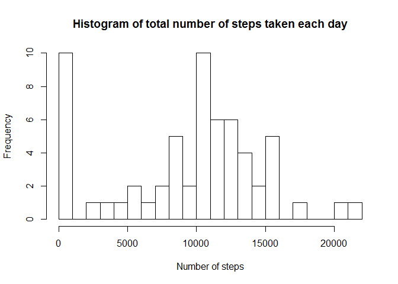
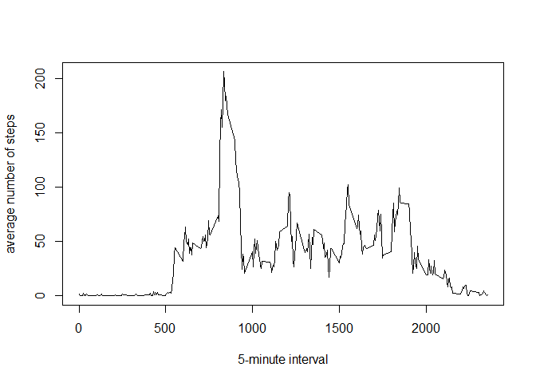
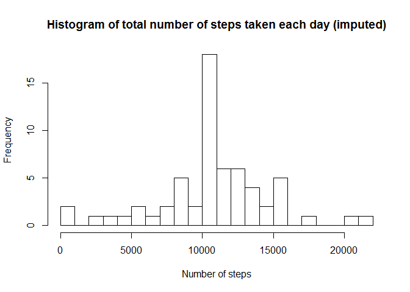

# Reproducible Research: Peer Assessment 1


## Loading and preprocessing the data

```r
data <- read.csv(unz("activity.zip", "activity.csv"))
data$date <- as.Date(data$date)
```

## What is mean total number of steps taken per day?

```r
library(dplyr)
```

```
## Warning: package 'dplyr' was built under R version 3.2.1
```

```
## 
## Attaching package: 'dplyr'
## 
## The following objects are masked from 'package:stats':
## 
##     filter, lag
## 
## The following objects are masked from 'package:base':
## 
##     intersect, setdiff, setequal, union
```

```r
byDate <- group_by(data, date)
stepsByDate <- summarize(byDate, total=sum(steps, na.rm=TRUE))
hist(stepsByDate$total, main="Histogram of total number of steps taken each day", xlab="Number of steps", breaks=20)
```

 

Mean total steps:

```r
mean(stepsByDate$total)
```

```
## [1] 9354.23
```

Median total steps: 

```r
median(stepsByDate$total)
```

```
## [1] 10395
```


## What is the average daily activity pattern?

```r
byInterval <- group_by(data, interval)
stepsByInterval <- summarize(byInterval, mean=mean(steps, na.rm=TRUE))
plot(stepsByInterval, type="l", xlab="5-minute interval", ylab="average number of steps")
```

 

Interval with the highest mean number of steps:

```r
stepsByInterval[which.max(stepsByInterval$mean),]$interval
```

```
## [1] 835
```


## Imputing missing values
Number of rows with missing values:

```r
sum(!complete.cases(data))
```

```
## [1] 2304
```

Missing values are imputed by replacing them with the mean of the corresponding 5-minute interval.

```r
imputedData <- data
for (i in seq_len(nrow(stepsByInterval))) {
  imputedData[imputedData$interval==stepsByInterval[i,]$interval & is.na(imputedData$steps), "steps"] = stepsByInterval[i,]$mean
}
byDate <- group_by(imputedData, date)
stepsByDate <- summarize(byDate, total=sum(steps))
```

After the missing values are imputed, we get the following histogram:

```r
hist(stepsByDate$total, main="Histogram of total number of steps taken each day (imputed)", xlab="Number of steps", breaks=20)
```

 

Mean total steps:

```r
mean(stepsByDate$total)
```

```
## [1] 10766.19
```

Median total steps:

```r
median(stepsByDate$total)
```

```
## [1] 10766.19
```
The mean and the median are higher now.

## Are there differences in activity patterns between weekdays and weekends?
Using the imputed data, add a column that indicates for each date whether it's a weekday or weekend.

```r
library(lattice)
imputedData <- mutate(imputedData, dayType=as.factor(ifelse(weekdays(imputedData$date) %in% c("Saturday","Sunday"), "weekend","weekday")))
```

Evaluate the mean for each 5-minute interval, for weekends and for weekdays, and plot in a panel.

```r
par(mfrow=c(1,1))
imputedData <- group_by(imputedData, interval, dayType)
stepsByIntervalDaytype <- summarize(imputedData, meanSteps=mean(steps))
with(stepsByIntervalDaytype, xyplot(meanSteps ~ interval | dayType, type="l", layout=c(1,2), ylab="number of steps"))
```

 
